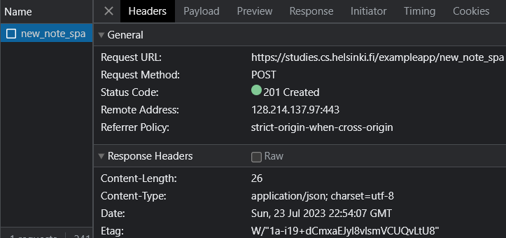

# Fundamentals of Web Apps

## Developer Console

`ctrl + shift + i` in chrome - windows/linux
`option-cmd-i` in chrome - MacOS

## HTTP GET

The server and the browser communicate with each other via HTTP (Hyper-text transfer protocol)


When the page is loaded, the browser fetches contents of the page: https://studies.cs.helsinki.fi/exampleapp/ from the server and has downloaded the image (kuva.png)

 <br>
The headers in the above image show the details of request and response exchange done by the browser (client) and server.

<b>- General headers</b>

- Request URL → the URL we want access
- Request Method → the method used by HTTP/HTTPS to request the details
- Status Code → are issued by the server in response to the request, these specify the standard statuses of responses.

  ```
  Note:
  1xx informational response – the request was received, continuing process
  2xx successful – the request was successfully received, understood, and accepted
  3xx redirection – further action needs to be taken in order to complete the request
  4xx client error – the request contains bad syntax or cannot be fulfilled
  5xx server error – the server failed to fulfil an apparently valid request
  ```

  Ref.: https://en.wikipedia.org/wiki/List_of_HTTP_status_codes

  - Remote Address → server's IP Address
  - Referrer Policy → the referrer in HTTP header contains the full or partial address from where the resource has been requested; the referrer policy controls how much information about the referrer is to be included with the requests.

  ```
  Referrer-Policy: no-referrer
  Referrer-Policy: no-referrer-when-downgrade
  Referrer-Policy: origin
  Referrer-Policy: origin-when-cross-origin
  Referrer-Policy: same-origin
  Referrer-Policy: strict-origin
  Referrer-Policy: strict-origin-when-cross-origin
  Referrer-Policy: unsafe-url
  ```

  Ref.: https://developer.mozilla.org/en-US/docs/Web/HTTP/Headers/Referrer-Policy

<b>- Response Headers </b><br>
 <br>

- Connection → indicates whether the network connection stays open after the current transaction finishes
- Content Length → size of the response (bytes)
- Content Type → format the response file along with the format type
- Date → time the message was created
- ETag → known as the entity tag; refers to the specific version of the resource
- Server → specifies the software used by the server at the time of response
- X-Powered-By → refers to the technologies used by the web server. Note: the prefix `X-` in a header means that it is a non-standard header

Ref.: https://dev.to/spukas/http-headers-explained-4kg1 <br>

- Sequence Diagram of request and response: <br>
   <br>

## Traditional web applications

In a traditional web application, when an URL is accessed through the browser, it fetches the HTML document containing the structure and textual details of the accessing page from the server. The HTML document could either be static (file saved on the server) or dynamic (server forms the file with the application code, eg.: data from database).

## Running application logic in the browser

The browser fetches the HTML as the first document, from that page it fetches the JavaScript file from the script tag from the `head` element of the HTML code.

## Event handlers and Callback functions

Event handler are known as callback (a function passed into another function as input) functions. The browsers invoke the event handlers when the event on the webpage has occurred.

## Document Object Model (DOM)

HTML pages are implemented in a tree-like structure. Document Object Model (DOM) is an Application Programming Interface (API) that allows modifications of the elements to reflect on webpages. <br>

```
var ul = document.createElement('ul')

data.forEach(function(note) {
  var li = document.createElement('li')

  ul.appendChild(li)
  li.appendChild(document.createTextNode(note.content))
})

document.getElementsByClassName('notes').appendChild(ul)
```

From the above code, new child nodes are created (`ul`) which is referred by the class name `notes`.

## Manipulating the document object from console

The root of the DOM tree in a HTML document is called the `document` object. By typing `document` on the console, the DOM tree can be accessed.
<br>

<br>

Eg.: By getting the element using its tag name `ul`, a new list can be appended to the notes list on the webpage. Although the below changes reflected on the web are not permanent as they are just happening on our browser and are not updated on the main server.
<br>

<br>

## Cascading Style Sheets (CSS)

CSS is a style sheet language used to determine the appearance of the website. <br>

```
.container {
  padding: 10px;
  border: 1px solid;
}

.notes {
  color: blue;
}
```

The `.container` and `.notes` are known as class selectors, these are used to select certain parts of the page to define rules for styling. These classes are attributes that are then added to HTML elements in order for the stylings to reflect of HTML elements.

- Elements tab on developer tool can be used to alter the stylings, this only reflects on the website and are not saved on the server: <br>
   <br>

## Loading a page containing JavaScript - review

- Sequence Diagram of request and response of the notes page: (https://studies.cs.helsinki.fi/exampleapp/notes): <br>
   <br>

Process:

- Browser → [GET] The browser requests the HTML code (which contains the content and page structure) from the server for the [page](https://studies.cs.helsinki.fi/exampleapp/notes).
- Server → Sends requested HTML document to the browser.
- Browser → [GET] Requests the main.css file for the page from the server.
- Server → Sends the requested css file.
- Browser → [GET] Requests the Js file for the file from the server.
- Server → Sends the requested JS file and the browser starts executing it.
- Browser → [GET] Upon executing the JS file, the browser requests to fetch the data.json file from the server.
- Server → Sends the json object to the browser and it executes event handler that renders the notes to the page using DOM-API.

## Forms and HTTP POST

The notes page contains a `form element`, here when the button `Save` is clicked the browser sends the user input to the server. The action of sending data from the browser to the server is known as `POST` request.

- Network Traffic when adding a new note: <br>
   <br>

While submitting the new note, the first HTTP request occurs from the `form submit event` which is a HTTP POST request to the server. The server then responds with the `302` status code which is an URL redirect (the server requests the browser to do a new HTTP GET request to the new address in header's location). Once this is done, the browser reloads the page creating 3 GET requests of requesting main.css, main.js and data.json.

The `Form` element has attributes called: action and method that needs to be defined when submitting the form in HTML.
 <br>

Below is the code on the server that is responsible for the POST method defined on the form element.

```
app.post('/new_note', (req, res) => {
  notes.push({
    content: req.body.note, # contains the actual content of the note
    date: new Date(), # contains the date-time of the created note
  })

  return res.redirect('/notes')
})
```

The data is sent as the `body` from the POST request which the server then accesses by `req.body` from the request object. The server then creates a new note object and pushes it to the notes array. Since the array is not saved on the database, these new notes are disappeared when the server is restarted.

## Asynchronous JavaScript and XML (AJAX)

- An approach used to fetch content to web-pages using JavaScript that was included within HTML without the need of re-rendering the page.
- In a traditional web application (i.e. before AJAX), the data on the page was fetched with the generated HTML code from server.

## Single page application (SPA)

- SPA-styled websites don't fetch all the pages separately from the server, instead it fetches the main HTML page that are manipulated with JavaScript executed in the browser.

   <br>

- While adding a new note at https://studies.cs.helsinki.fi/exampleapp/spa, the browser sends only one request unlike the traditional method.

## JavaScript Libraries 

- The traditional websites used VanillaJs which used only the DOM-API and JS to manipulate the page structure, then jQuery was used due to its popularity in having a cross-browser compatibility. 
- During the rise of the SPA-styled web apps, BackboneJS was introduced then AngularJs, ReactJs, VueJs, etc. were introduced.

