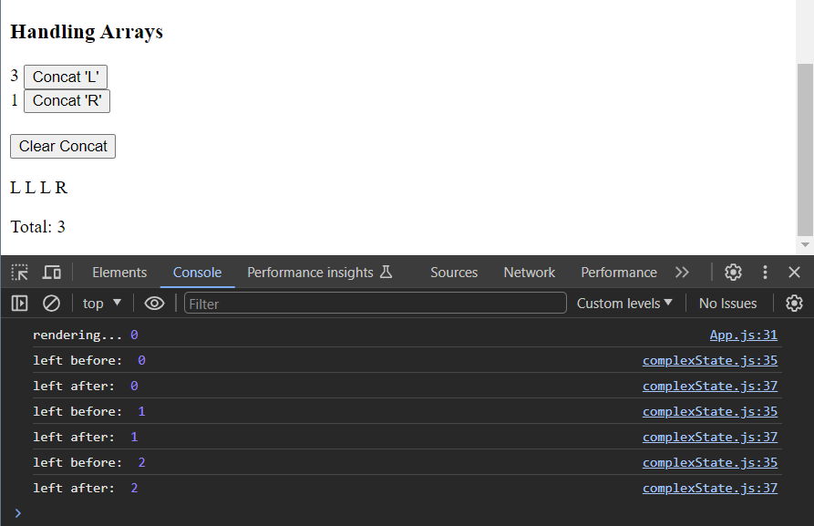
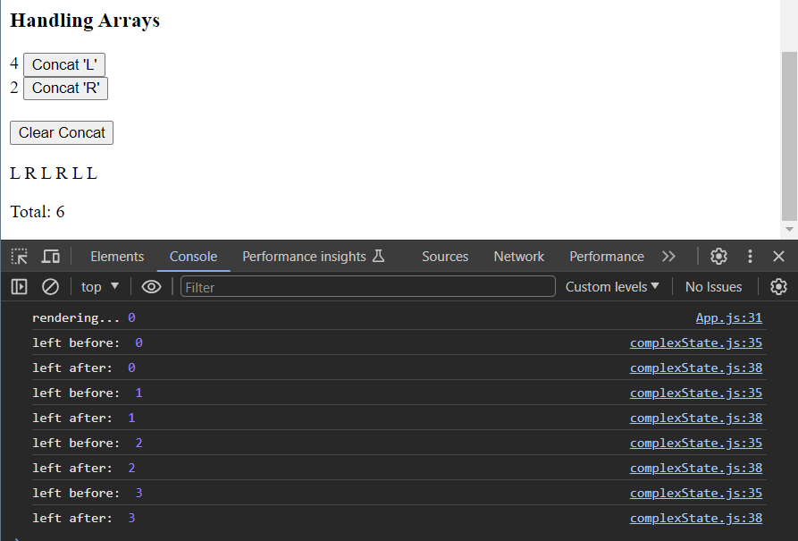

# A more complex state, debugging React apps

## Complex state

- For applications that needs a more complex state, an optimal way to achieve this is to use `useState` function multiple times to create separate pieces of state.

```js
import React, { useState } from "react";

const MoreCounters = () => {
  const [left, setLeft] = useState(0);
  const [right, setRight] = useState(0);

  const handleLeft = () => {
    setLeft(left + 1);
  };

  const handleRight = () => {
    setRight(right + 1);
  };
  return (
    <div>
      <h3>Applying complex states</h3>
      <div>
        {left}
        <button onClick={handleLeft}>Left Counter</button>
      </div>
      <div>
        {right}
        <button onClick={handleRight}>Right Counter</button>
      </div>
    </div>
  );
};

export default MoreCounters;
```

👆🏼 can also be written as:

```js
const [clicks, setClicks] = useState({
  left: 0,
  right: 0,
});

const handleLeftClicks = () => {
  const newClicks = {
    ...clicks,
    left: clicks.left + 1,
  };
  setClicks(newClicks);
};

const handleRightClicks = () => {
  const newClicks = {
    ...clicks,
    right: clicks.right + 1,
  };
  setClicks(newClicks);
};
```

- Below is an approach that is not recommended to be used in React as it creates mutate state directly and is forbidden in React. This causes unexpected side effects. Changing state has to always be done by setting the state to a new object.

## Handling arrays

```js
const [allClicks, setAllClicks] = useState([]); //array handlers

const handleLeftConcat = () => {
  setAllClicks(allClicks.concat("L"));
  setLeft(left + 1);
};

const handleRightConcat = () => {
  setAllClicks(allClicks.concat("R"));
  setRight(right + 1);
};

const handleConcatClear = () => {
  setAllClicks([]);
};
```

- The state stored in `allClicks` is an array which stores the previous state and the letter (L, R). The `concat()` is a method used to add a new item and it does not mutate the existing array instead creates a new copy of the array with the added item to it. This abides the rules of React of not mutating a state directly, an alternative method instead of using `concat()` would be `push()` which mutates the state directly that should not be used.

## Update of the state is asynchronous

- After adding a state to keep track of the total clicks, it is notable from the console log (ref. image) that even after a new value is set for `left` by calling `setLeft()` it is not reflected immediately. This is because of React's nature of updating the state in an asynchronous way that it would reflect at some point before the component is re-rendered.

```js
const handleLeftConcat = () => {
  setAllClicks(allClicks.concat("L"));
  console.log("left before: ", left);
  setLeft(left + 1);
  console.log("left after: ", left);
  setTotal(left + right);
};
```



- To resolve this behavior, a new variable can be declared for updating the value:

```js
const handleLeftConcat = () => {
  setAllClicks(allClicks.concat("L"));
  console.log("left before: ", left);
  const updateLeft = left + 1; //new variable
  setLeft(updateLeft);
  console.log("left after: ", left);
  setTotal(updateLeft + right);
};

const handleRightConcat = () => {
  setAllClicks(allClicks.concat("R"));
  const updateRight = right + 1;
  setRight(updateRight);
  setTotal(left + updateRight);
};
```



## Conditional Rendering

- Conditional rendering allows to render entirely different React components based on the state of the application.

```js
const History = (props) => {
  /*
    The following function renders the div component through conditional rendering.
  */
  if (props.allClicks.length === 0) {
    return <div>the app is used by pressing the button</div>;
  }
  return <div> button press history: {props.allClicks.join("")}</div>;
};
```

## Old React

- From React version 16.8.0 onwards the `state hook` was added in order to implement states to React components.
- Before the addition of hooks (in functional components), state could only be defined as a class component.
