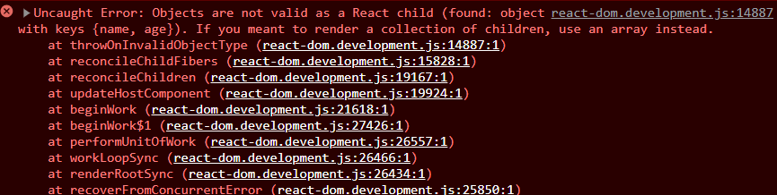

# Introduction to React

- Create a react project run: `npx create-react-app`.
- `npm start`: runs the application in localhost

## Component

The file `App.js` in `src` directory defines a React component with the name `App`, in which it is rendered by the `div` element in the index.js file. The `public/index.html` is the main HTML file that includes the React code and provides a context for React to render to. The id `root` mentioned in the index.js file refers to the div element's id in the public/index.html file.

```javascript
ReactDOM.createRoot(document.getElementById("root")).render(<App />);
```

<br>

The components created in React are defined as JavaScript functions that are assigned to a variable:

```javascript
() => (
  <div>
    <p>Hello world</p>
  </div>
);
```

- The above function is defined by an arrow function which returns the value of the expression.
- Dynamic contents can also be rendered within a component.

```javascript
const App = () => {
  const now = new Date();
  console.log(now);
  return (
    <div>
      <p>Hello World, it is {now.toString()}</p>
    </div>
  );
};

export default App;
```

- Any JS code within the curly brackets `{now.toString()}` are evaluated and the result is embedded into the desired component produced in HTML.

## JSX (JavaScript Syntax Extension)

- React components return HTML markups, but they are written mostly using JSX.
- JSX returns React components which are compiled into JavaScript.
- The application looks like the below code after compiling, which is handled by `Babel` (with `create-react-app`, it is configured to automatically compile the application):

```javascript
const App = () => {
  const now = new Date();
  return React.createElement(
    "div",
    null,
    React.createElement("p", null, "Hello world, it is ", now.toString())
  );
};
```

- JSX is XML-like where every HTML tags needs to be closed

## Multiple components

```javascript
const Hello = () => {
  return (
    <div>
      <p>Hello</p>
    </div>
  );
};
const App = () => {
  const now = new Date();
  console.log(now);
  return (
    <div>
      <Hello />
      <p>The time is {now.toString()}</p>
    </div>
  );
};

export default App;
```

- Many components can be created and rendered in various pages.
- The `App` is the root component, but there can be situations where it is not exactly the root component by is wrapped within an appropriate utility component.

## Props: passing data to components

- Props can be used to pass data to the components

  ```javascript
  const Hello = (props) => {
    return (
      <div>
        <p>Hello {props.name}</p>
      </div>
    );
  };
  const App = () => {
    const now = new Date();
    console.log(now);
    return (
      <div>
        <Hello name="John Doe" />
        <p>The time is {now.toString()}</p>
      </div>
    );
  };
  export default App;
  ```

  ↑ The function `Hello` is defined with a parameter props. This parameter receives an object which has fields corresponding to all the `props` the user of the component `App` defines. Eg: `<Hello name='John Doe'/>`

- Values of the props can also be sent through JS expressions (while assigning using JS, it must be wrapped using a curly brackets):

  ```javascript
  const App = () => {
    const now = new Date();
    const name = "Jane Doe";
    const age = 10;
    return (
      <div>
        <Hello name={"John Doe"} />
        <Hello name={name} age={age} />
        <p>The time is {now.toString()}</p>
      </div>
    );
  };
  ```

## Extra notes

- When creating a new component with React, the component name must be defined with the first letter capitalized; React creates a div-element defined in the creating component and is rendered on the page.
- The content of the React component usually needs to be wrapped within a root element.

  ```javascript
  <!-- Here the returning HTML is wrapped using div-element (root element) -->
    return (
    <div>
      <Hello name={"John Doe"} />
      <Hello name={name} age={age} />
      <p>The time is {now.toString()}</p>
    </div>
  );
  ```

- Other than wrapping the return using a root element it is also possible to return as an array without wrapping.

  ```javascript
  const App = () => {
    const now = new Date();
    const name = "Jane Doe";
    const age = 10;
    return [
        <Hello name={"John Doe"} />
        <Hello name={name} age={age} />
        <p>The time is {now.toString()}</p>
    ];
  };
  ```

- When defining a root component (Eg: App.js) it is not recommended to wrap its returning child components with div-element as it adds extra div elements to the DOM tree, this can be avoided by using fragments, which returns the component with an empty element.

```javascript
const App = () => {
  const now = new Date();
  const name = "Jane Doe";
  const age = 10;
  return (
    <>
      <Hello name={"John Doe"} />
      <Hello name={name} age={age} />
      <p>The time is {now.toString()}</p>
    </>
  );
};
```

## Do not render objects

In the application below which prints the names and ages of out friends on screen, it tends to throw an error of "Objects are not valid as a React child", which means that the application is trying to render the objects and it fails over and over again.

```javascript
const App = () => {
  const friends = [
    { name: "Peter", age: 4 },
    { name: "Maya", age: 10 },
  ];

  return (
    <div>
      <p>{friends[0]}</p>
      <p>{friends[1]}</p>
    </div>
  );
};

export default App;
```

Error:


↑ The error above occurs when `<p> {friends[0]} </p>` is rendering a value from an object: `friends`.

To fix this, the individual values being rendered from the object must be primitive values (numbers, strings) and not the whole object itself.

```javascript
const App = () => {
  const friends = [
    { name: "Peter", age: 4 },
    { name: "Maya", age: 10 },
  ];

  return (
    <div>
      <p>
        {friends[0].name}, {friends[0].age}
      </p>
      <p>
        {friends[1].name}, {friends[1].age}
      </p>
    </div>
  );
};
```
