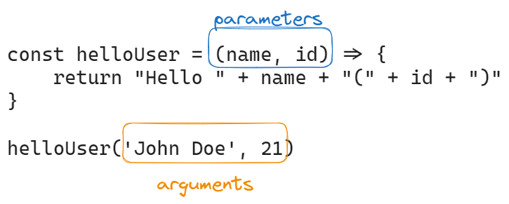

# JavaScript

- Standard name of JS is ECMAScript which is currently on the version ES14, but many browsers don't support them hence we need to transpile the code to older version supported by the browsers.
- Babel: a popular trans-compiler, automatically configured in React when created with `create-react-app`.
- NodeJs - a JS runtime environment which is based on Chrome's V8 JS engine. The latest Node version doesn't need to be trans-compiled since it can understand the latest version of JS.

## Variables

```javascript
const x = 1;
let y = 5;

y += 10;
console.log(x, y); // prints 1, 15

x = 2;
console.log(x, y); // causes error since the const does not define a variable instead it defines a constant where the value cannot be changed
```

### var keyword

```javascript
function varPrint() {
  for (var i = 0; i < 10; i++) {
    console.log(i);
  }
  console.log(i); // this would still print the number 10 since the scope of the variable is within the function
}
```

```javascript
function varPrint() {
  for (var i = 0; i < 10; i++) {
    console.log(i);
  }
}
varPrint();
console.log(i); // this would cause an error stating undefined since `i` is logged outside the function
```

### let keyword

```javascript
function varPrint() {
  for (let i = 0; i < 10; i++) {
    console.log(i); // prints the numbers
  }
  console.log(i); // this would cause a reference error since the variable is being called outside of its function scope
}
```

### const keyword

- Used to declare a variable that is constant (won't be changing)

```javascript
const dog = {
  age: 3,
};
dog.age = 5;
dog = { name: "biko" }; // this would throw an error since the object `dog` cannot be assigned with another variable than age
```

## Arrays

```javascript
const t = [1, -1, 3];

t.push(5);

console.log(t.length); // 4 is printed
console.log(t[1]); // -1 is printed

t.forEach((value) => {
  // calls the arrow function of value for each item in the array
  console.log(value); // numbers in the array are printed on separate lines
});
```

- The contents of the array can be modified even though it has been declared using a `const`. This is because arrays are objects in JS and objects are mutable. The `const` prevents the variable from being reassigned and doesn't prevent the values within the array to be manipulated.

- To prevent the contents of an array from being modified, `Object.freeze()` method can be utilized. This method will make the array immutable, so it cannot be modified.

```js
const arr = [1, 2, 3];
Object.freeze(arr);

// The following code will throw an error
arr.push("item");
```

### Array Methods:

- When using ReactJs, it is preferred to use functional programming techniques such as using immutable data structures. Thus in ReactJs, instead of `.push()`, `concat()` method can be used which creates a new array with the added item, assuring that the original array stays unchanged.

- `.map()` is a popular method used in ReactJs and is used instead of `.forEach()` method since `.map` creates a new array with the array contents.

```js
const t = [1, 2, 3, 4];

const mulNum = t.map((value) => value * 2);
```

- Ref: [Array Methods](https://developer.mozilla.org/en-US/docs/Web/JavaScript/Reference/Global_Objects/Array)

### Array - destructuring assignment

- The [destructuring assignment](https://developer.mozilla.org/en-US/docs/Web/JavaScript/Reference/Operators/Destructuring_assignment#try_it) syntax in JS unpacks values from arrays or object properties into unique variables.

```js
const t = [1, 2, 3, 4];

const [first, second, ...rest] = t; //first is assigned with `1`, second to `2` and the remaining values can be unpacked using `rest` syntax
```

- Note: `...rest` syntax must always be at set at the end of an array to pack the remaining values into a variable.

### Objects

- Objects in JS are defined using Object Literals: `{}`

```js
const object1 = {
  name: "Arto Hellas",
  age: 35,
  education: "PhD",
};

const object2 = {
  name: "Full Stack web application development",
  level: "intermediate studies",
  size: 5,
};

const object3 = {
  name: {
    first: "Dan",
    last: "Abramov",
  },
  grades: [2, 3, 5, 3],
  department: "Stanford University",
};
```

- Values in objects can be of any types (numbers, strings, arrays, objects, boolean, etc.)

- Properties in an object are referenced using the "dot notation" or brackets:

  ```js
  console.log(object1.name);
  console.log(object1["age"]);
  ```

- The dot notation or brackets can also be used to add new properties:

  ```js
  object1.address = "Test";
  object1["secret number"] = 12341;
  ```

- Objects can also be defined by `constructor functions`; a [constructor function](https://developer.mozilla.org/en-US/docs/Web/JavaScript/Reference/Classes/constructor) allows creating and initializing an object of that corresponding class.

  ```js
  class Polygon {
    constructor() {
      this.name = "Polygon";
    }
  }

  const poly1 = new Polygon();

  console.log(poly1.name);
  ```

### Functions

- Functions were originally declared using the function expression before arrow functions were introduced in ES6 - JS:

  ```js
  <!-- Functions declared using functional expression -->
  const average = function (a, b) {
    return (a + b) / 2;
  };
  const result = average(2, 5);
  ```

  ```js
  <!-- Functions declared using arrow syntax -->
  const average = (a,b) => {
    return (a+b)/2
  }
  ```

- Functions with one parameter can also be declared without the brackets:

  ```js
  const square = (p) => p * p;
  ```

`NOTE:` <br>


